# SQL-Basic-Intermediate-Practice

Practice Base/Intermediate SQL queries on the Northwind Database in SQL Server.
This practice include the basics of queries, like SELECT, ORDER BY, WHERE, GROUP BY, several agregate functions and some more intermediate topics like joins between different tables and subqueries.
In the repository you can find examples of questions about the Northwind database, solved with SQL queries.
Next you can see an image of the database schema:

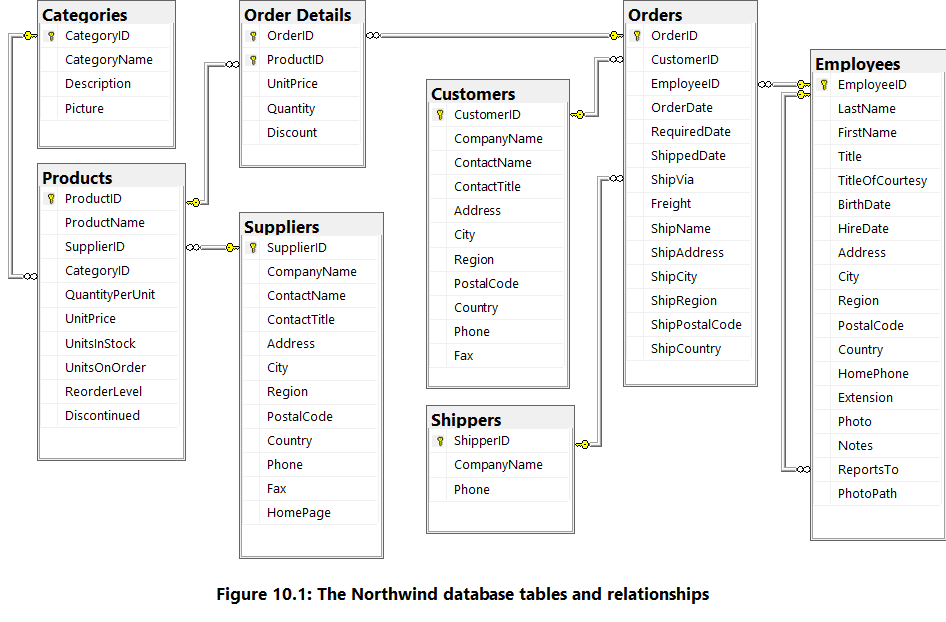

The questions to answer with the queries and the results are the following:

### Exercise 1: Find the top 3 customers by total order value

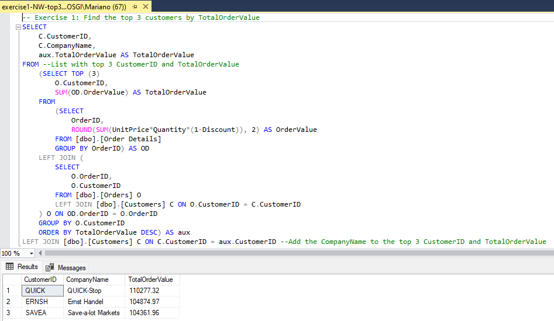

### Exercise 2: Identify the products that have never been ordered

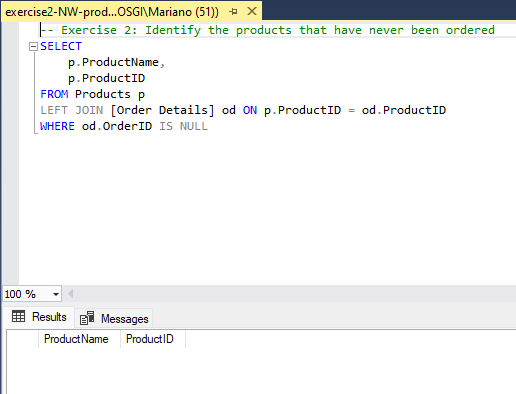

Like can be seen in the image, there is no product that have never been ordered, what is the same as, every product have been ordered at least 1 time.

### Exercise 3: Calculate the average time(in days) between an order is placed and when it is shipped

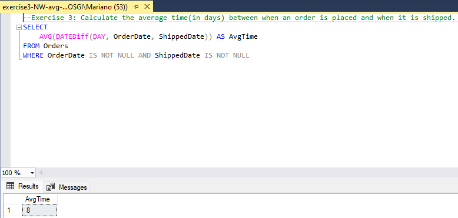

### Exercise 4: Find the employees who have the most direct reports

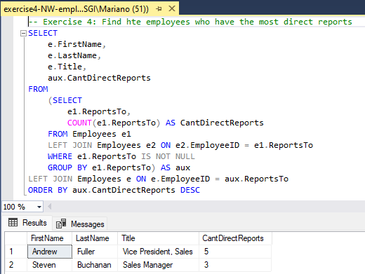

### Exercise 5: Create a report showing the total sales per product category per year (use orderdate as time)

Query:

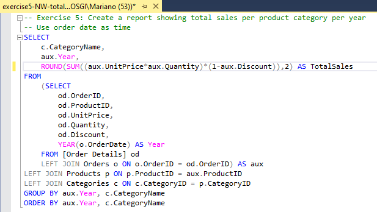

Result:

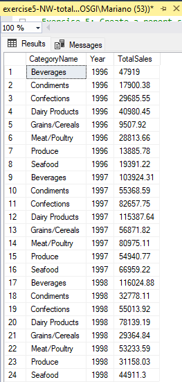

### Exercise 6: Find the 3 suppliers who have the highest percentage of discontinued products

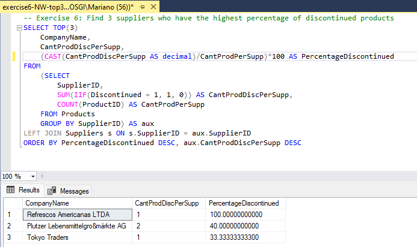

### Exercise 7: Get the top 5 orders by total value, including customer name and order date

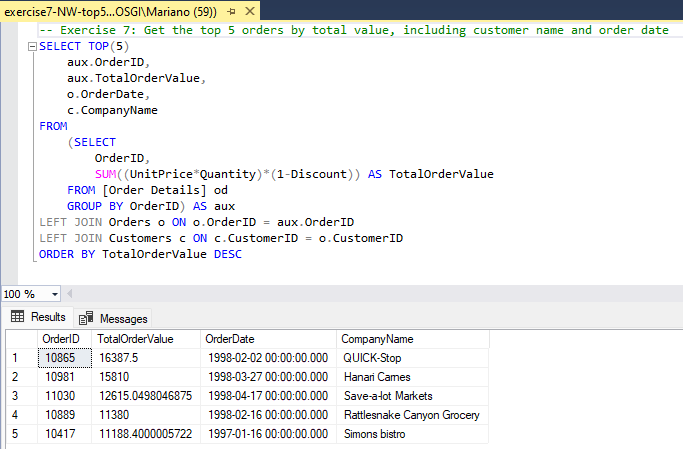

### Exercise 8: Find the top 3 freight carriers by total freight charges.

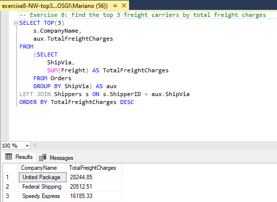

### Exercise 9: Create a query to get the count of orders per employee per year

Query:

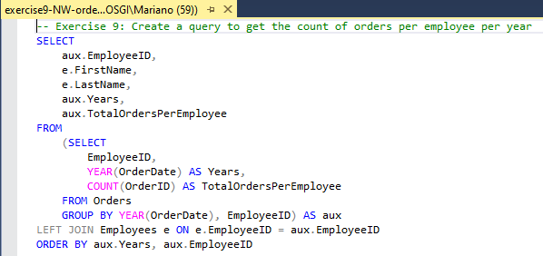

Result:

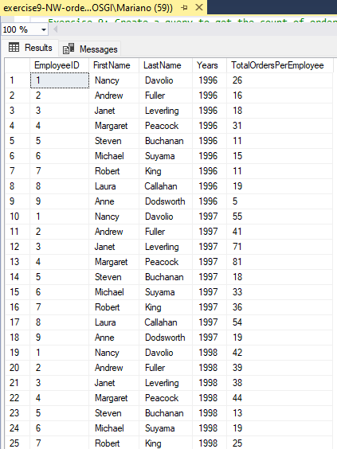

### Exercise 10: Find the 5 products with the highest total sales revenue

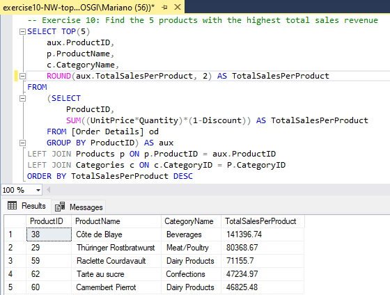
